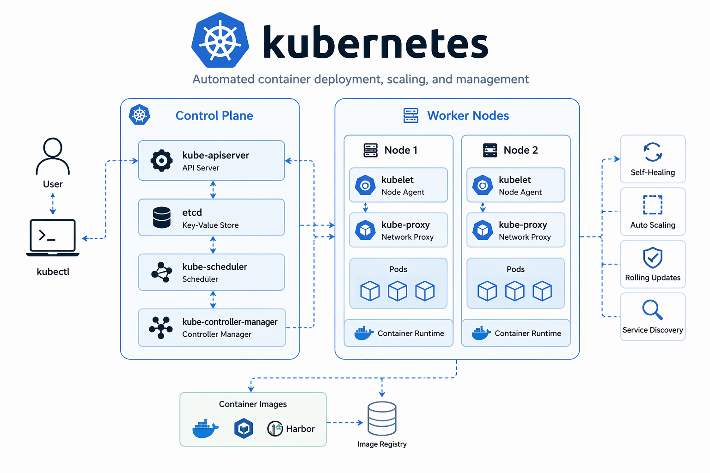

# Kubernetes Repository

🔗 Blog: [Kubernetes 자료](https://lucky-gun.com/tag/kubernetes/)

이 저장소는 Kubernetes 학습, 실습, 그리고 실제 운영 환경 구성을 기록한 공간입니다.

## 📂 Repository Structure

### 🧪 Practice (실습 & 실험)
| 디렉토리 | 설명 |
|----------|------|
| k8s-infra-setup | Kubernetes 클러스터 구축 과정 (ver1, ver2) |

---

### ⚡ index (참고 자료 정리)
| 디렉토리 | 설명 |
|----------|------|
| fast_installation | 빠른 구축을 위한 간단한 코드 정리 |

---

### 🔑 my-website
| 디렉토리 | 설명 |
|----------|------|
| -- | CI/CD 기반 블로그 배포 (현재 운영 중) |
